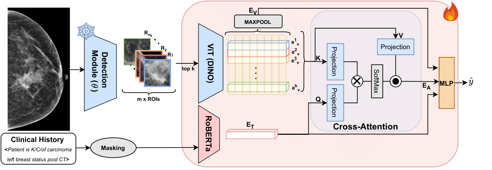

*MMBCD is multimodal breast cancer classification model. It utilizes a cross-attention layer to attend to top K ROI embeddings by the textual representation of the clinical history. Our findings reveal the synergistic impact of textual, visual, and cross-attention embeddings on the accuracy of breast cancer detection.*
# MMBCD: Multimodal Breast Cancer Detection

### [[Paper]()] [[Project Page](https://mammo-iitd-aiims.github.io/MMBCD)]

[Kshitiz Jain<sup>1</sup>](https://www.linkedin.com/in/kshitiz-jain-7a5b4a129/)
, [Aditya Bansal<sup>2</sup>](https://www.linkedin.com/in/adsbansal/)
, [Krithika Rangarajan<sup>3</sup>](https://scholar.google.com/citations?user=6A3dai4AAAAJ&hl=en),
[Chetan Arora<sup>1</sup>](https://www.cse.iitd.ac.in/~chetan//)
<br/>
<sup>1</sup>IIT Delhi, <sup>2</sup> TIET Patiala, <sup>3</sup> AIIMS Delhi <br/>

This is the official code for the paper "MMBCD: Multimodal Breast Cancer Detection from Mammograms with Clinical History" accepted at MICCAI 24'

## Table of Contents

1. [Environment Setup](#environment-setup)
2. [Model Weights](#model-weights)
3. [Input Data Preperation](#input-data-preperation)
4. [Evaluation](#evaluation)
5. [Training](#training)
6. [Contact](#contact)

## Environment Setup

Setup the environment: [mmbcd.yml](./mmbcd.yml). Change ```--prefix``` in **mmbcd.yml** to the path you want to load env files to.

```bash
conda env create --name MMBCD -f mmbcd.yml
conda activate MMBCD
```

Version Specifications: 
- Python: 3.10.13
- Pytorch: 2.1.2
- CUDA: 11.8

## Model Weights
Please find the model weights for the best checkpoint - [Link](https://drive.google.com/file/d/1S4CrIaIsAijoV17bCmbjm5pXflJhjFFv/view?usp=share_link)

## Input Data Preperation

For Mammograms: 
- Mammograms are converted to PNG images.
- Use ```crop_black_space_single()``` in **preprocess/crop.py** to remove black spaces.
- Resize images to 1024 - **preprocess/resize.py** 
- Use a detection framework - save bounding boxes in txt files sorted by confidence scores. [Sample File](./sample_data/detection_output.txt)

For Clinical History:
- Textual Preprocessing.
- Remove punctuations, symbols. 
- Lowercase the text.
- Create a csv with the columns UHID, text, cancer, im_path, all_views_cancer   

### CSV format:

| UHID | text | cancer | im_path | all_views_cancer |
|---|---|---|---|---|
| Unique identifier | Clinical History description | diagnosis - 0 or 1  | relative path to whole image | 0 or 1 - indicates wherether if other laterality has cancer |

**[Sample Input CSV](./sample_data/test.csv): Not actual data**
<br>  </br>

## Evaluation

Change the following three paths in code/test.py: 
- **TEST_CSV:** Path to CSV file prepared before
- **TEST_IMG_BASE:** Base path to images 
- **TEST_TEXT_BASE:** Base path to detection bounding boxes in format - *base_path/uhid/im_path.txt*

#### Run the following command to evalutate: 
```bash
python code/test.py
```
<br>

#### Data Organisation

For whole images:
```bash
[TEST_IMG_BASE]
└─ uhid1
    └─ mammogram_11.png
    └─ mammogram_12.png
	└─ mammogram_13.png
	└─ mammogram_14.png
└─ uhid2
    └─ mammogram_21.png
    └─ mammogram_22.png
	└─ mammogram_23.png
	└─ mammogram_24.png
.
.
.
```
<br>

For detection bounding box proposals
```bash
[TEST_TEXT_BASE]
└─ uhid1
    └─ mammogram_11.txt
    └─ mammogram_12.txt
	└─ mammogram_13.txt
	└─ mammogram_14.txt
└─ uhid2
    └─ mammogram_21.txt
    └─ mammogram_22.txt
	└─ mammogram_23.txt
	└─ mammogram_24.txt
.
.
.
```

## Training


Change the following paths in code/test.py: 
1. **TRAIN_CSV:** Train Path to CSV file prepared before
2. **TRAIN_IMG_BASE:** Train Base path to images 
3. **TRAIN_TEXT_BASE:** Train Base path to detection bounding boxes in format base_path/uhid/im_path.txt
4. **EVAL_CSV:** Eval Path to CSV file prepared before
5. **EVAL_IMG_BASE:** Eval Base path to images 
6. **EVAL_TEXT_BASE:** Eval Base path to detection bounding boxes in format base_path/uhid/im_path.txt

### Hyper Parameters (train.sh) :  
* **topk:** The number of higest confidence crops from the detection module to be used.
* **img_size:** Size of crops as input to image encoder.

### Training Script: 
```bash 
models/mmbcd/train.sh
```
<br>

## Contact
Should you have any question, please contact kshitiz@scai.iitd.ac.in, alternatively contact adsb.works5@gmail.com.  
<br>
**Acknowledgments:** We thank [Mr. Rohan Raju Dhanakshirur](https://scholar.google.co.in/citations?user=ew9VPnAAAAAJ&hl=en) for his assistance. We also thank DBT, Govt. of India, and Center of Excellence under the Ministry of Education, Govt. of India. Also, we thank Yardi School of Artificial Intelligence, IIT Delhi for travel grants.
